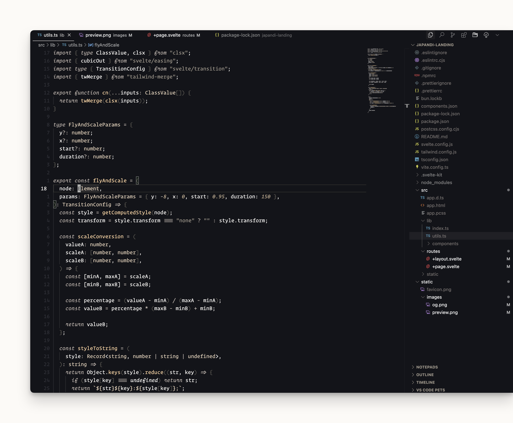

# Japandi by Webhooked

Japandi combines the minimalism of Japanese design with the elegance of Scandinavian style to create a coding environment that's serene and focused. The theme features a carefully selected palette of muted earth tones, gentle contrasts, and natural textures, bringing harmony to your development experience.

## Recommended Settings and extension

For the best experience, we recommend using these settings in the VSCode settings.json:

```json
{
    "editor.fontFamily": "'Operator Mono', 'Berkeley Mono Variable'",
    "editor.fontSize": 14,
    "editor.lineHeight": 1.5
}
```

## About

This theme is crafted by Webhooked, inspired by the Japandi design philosophy that balances simplicity, natural elements, and functional beauty. It aims to create a coding environment that feels as calm as it is productive.

## Installation

### VScode Marketplace

Search for "Japandi Theme" in the VSCode extensions panel or click "Install" from the marketplace website.

<a href="https://marketplace.visualstudio.com/items?itemName=japandi.theme-japandi"><strong>Install now</strong></a>